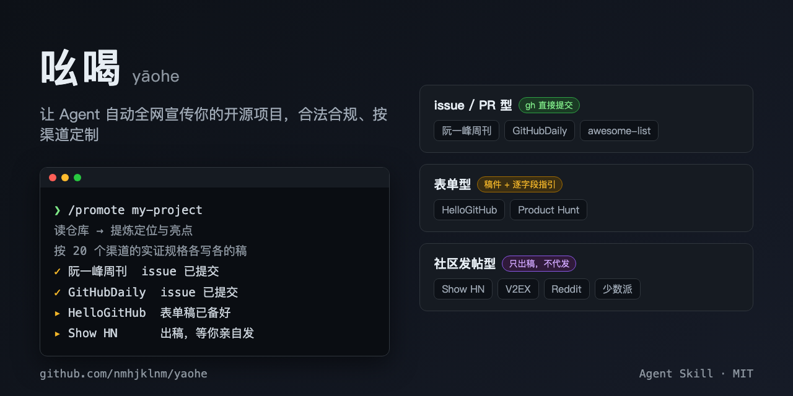

# 吆喝 yaohe

一个让 AI agent 自动全网宣传你的开源项目的 skill。



写完项目没人知道？宣传渠道很多（阮一峰周刊自荐、HelloGitHub、Show HN、V2EX…），但每个渠道格式不同、规则不同，还得一个个手动投。吆喝内置 20 个渠道的实证规格，把这件事变成一条命令，发新版本时顺手全网吆喝一嗓子：

```
/promote <repo 路径或 owner/repo>
```

它会：

1. **读你的 repo**，提炼项目定位和亮点
2. **按渠道定制文案** —— 阮一峰自荐格式、HelloGitHub 标准、Show HN 标题惯例，各写各的，不是一稿群发
3. **分级执行**：
   - issue/PR 型渠道（阮一峰周刊等）→ `gh` CLI 确认后直接提交
   - 表单型（Product Hunt 等）→ 稿件 + 逐字段指引
   - 社区发帖型（Show HN、V2EX、Reddit）→ 只出稿不代发，附最佳发帖时间和社区红线
4. **记录投递日志**（`PROMO-LOG.md`），防止重复骚扰渠道

## 为什么"合规"是核心设计

社区发帖型渠道反感机器发帖：HN 封 voting ring 连坐域名，Reddit 有 self-promotion 比例规则。所以吆喝的边界是：**自动化提交只用于渠道方明确开放的自荐入口（issue/PR/表单），社区帖永远人工发**。这不是功能缺失，是产品原则。

## 安装

```
claude plugin marketplace add nmhjklnm/yaohe
claude plugin install yaohe
```

## 渠道覆盖

见 [skills/promote/channels/](skills/promote/channels/)。每个渠道一个文件，含实证过的提交方式、格式规格、真实样例。欢迎 PR 添加新渠道（按 [channels/_template.md](skills/promote/channels/_template.md)）。

## License

MIT
